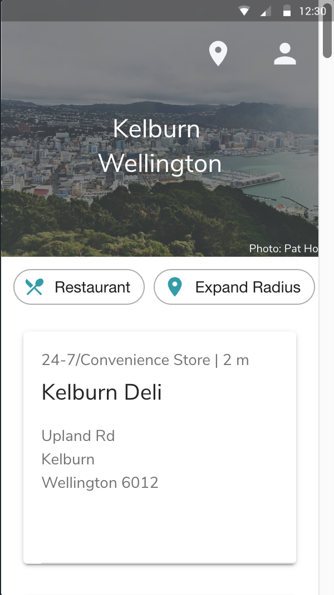
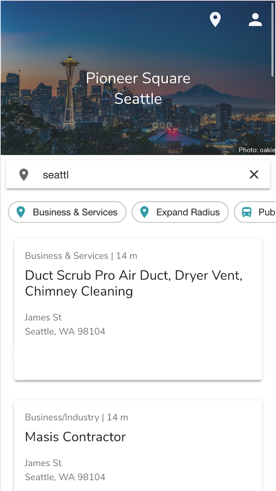
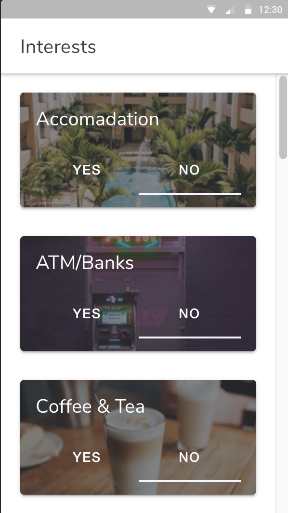
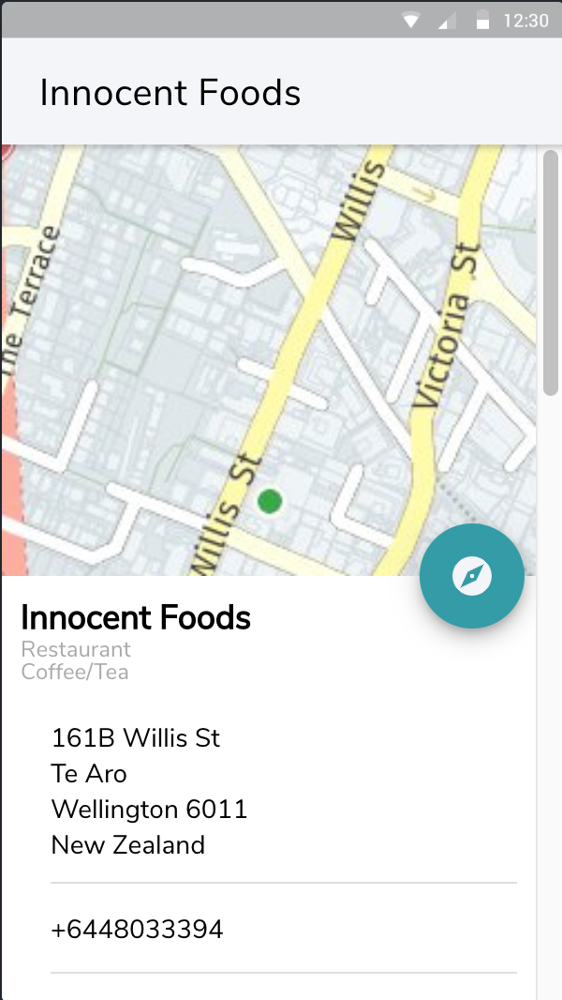
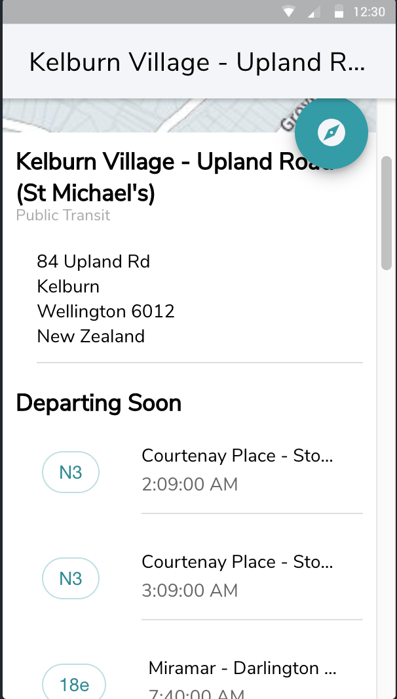
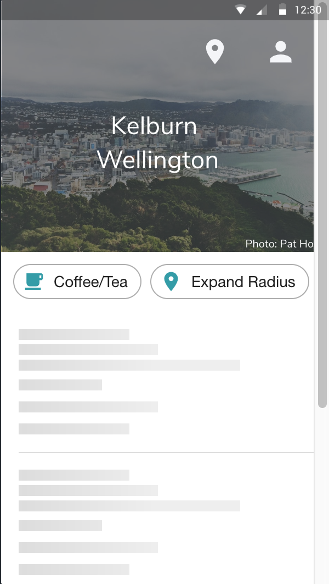

# LocalTip for Ionic
This app was created for SWEN 325 at Victoria University of Wellington in New Zealand. 
The associated report regarding UI/UX decisions, architecture, and an analysis of Ionic as a framework are attached under "325-a1-report-wilbanbric.pdf".
You can view the React Native version of this app here: [https://github.com/starfishak/localtip-reactnative](https://github.com/starfishak/localtip-reactnative)

## Overview ##
The mobile app gives a list of nearby places based on the users interests, as selected in the interest page. The nearby places list is an infinite list that generates more places farther away as the user scrolls down. Additionally, users can filter results with the material design chips below the image. All places and details come from the Here API. For each place, users are able to see details, such as phone numbers, websites, nearby public transit, and directions. If the place is a public transport station, users are able to see transit departing soon. The homepage updates with an image of the location the user is in from the Unsplash API. Users are also able to search any worldwide location with the "Location Pin".

| Homepage  | Homepage Search | Interest Page |
| ------------- | ------------- | ------------- |
|   |   |  |

| Place Details  | Public Transit Details | Skeleton Loading |
| ------------- | ------------- | ------------- |
|   |   |  |

## Clone & Demo ##
To test the LocalTip app, clone this repo.
Install the local node dependencies via npm.

### Ionic ###
You can run the app with the ionic serve command. Use the developer tools to mimic a mobile device screen size.

```ionic serve```

### APIs ###

You will need two sets of API keys to test the app, from the Here API and the Unsplash API. You may also request to use the development keys by sending an email to [support@sfeak.com](mailto:support@sfeak.com).

#### Here API #### 
[https://developer.here.com/](https://developer.here.com/)

Create an account. Create a project using the HERE Places API.
Copy and paste the API Key and API Code to src/cred.ts

#### Unsplash API ####
[https://unsplash.com/developers](https://unsplash.com/developers)

Create an account. Create a project; you may use LocalTip as the name and link to this repo for the description.
Copy and paste the Access Key and Secret Key to src/cred.ts